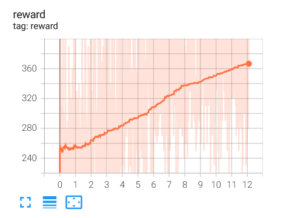
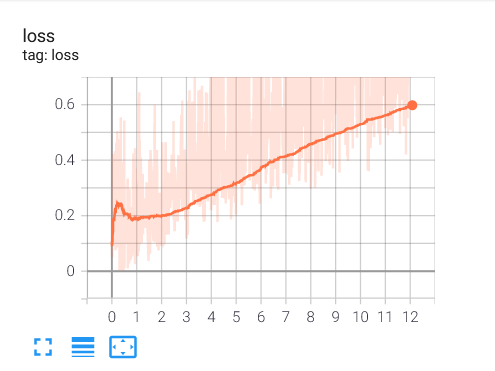

# Playing Atari 2600 Pacman using Dueling Double Deep Q-Networks with Prioritized Experience Replay

This repository contains a Tensorflow 2 implementation of a [Dueling Double Deep Q-Network](https://arxiv.org/abs/1511.06581) that can train and play Atari 2600 games (currently set to and trained on `MsPacman-v0`).
The model uses the OpenAI gym interface of the [Arcade Learning Environment (ALE)](https://github.com/mgbellemare/Arcade-Learning-Environment) to interact with the environment.

The directory structure is shown below. `main.py` can be run to start the training and models will be saved in `checkpoints\` every 20,000 iterations.

```text
.
├── checkpoints
├── main.py
├── models
│   ├── __init__.py
│   └── d3qn.py
└── utils
    ├── __init__.py
    └── prioritizedreplaybuffer.py
```

The initial parameters set for training are:

```text
Maximum number of frames to see = 10000000
Frequency of running an evaluation loop = 200000
Maximum frames in an episode = 18000
Size of the replay buffer after which training starts = 50000
Maximum experiences to be stored in the replay buffer = 1000000
Frequency of updating the target Q-network = 10000
```

---
> Reward after training for 600,000 frames
> 
---
> Loss after training for 600,000 frames
> 
---
